## 1. Create Your Directory
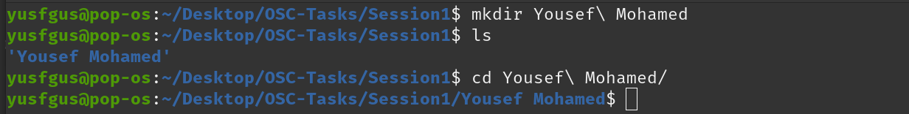

## 2. Make Another Directory and Create Multiple Files
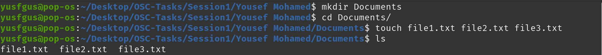

## 3. Hide a File
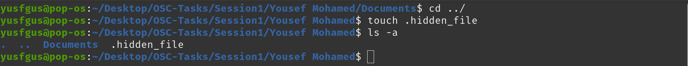

## 4. Write with Nano
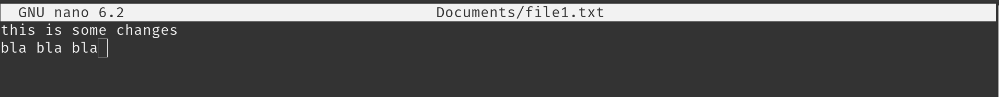
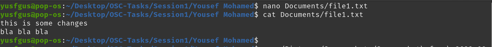

## 5. Go Back
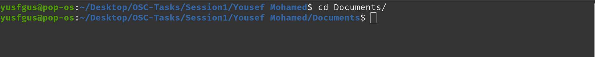

## 6. Create a Unique Directory
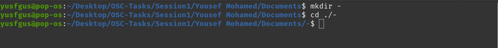

## 7. Copy Directory
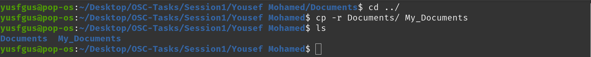

## 8. Show Hidden Content
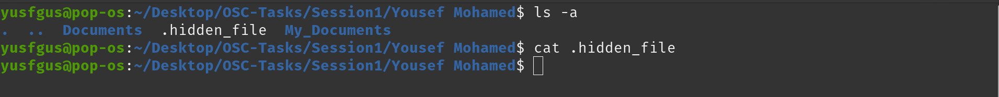

## 9. Move Files
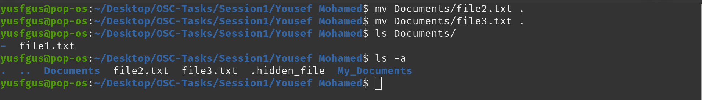

## 10. Remove Your Directory
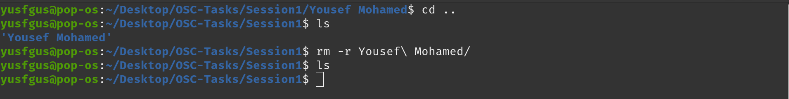