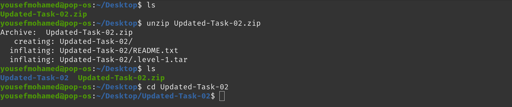
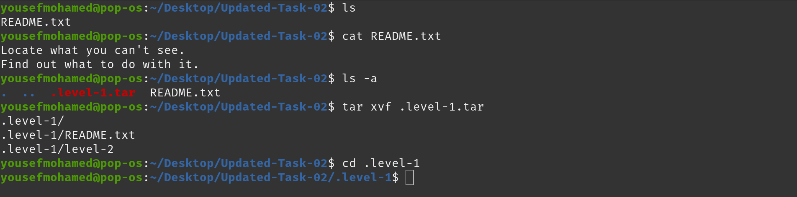
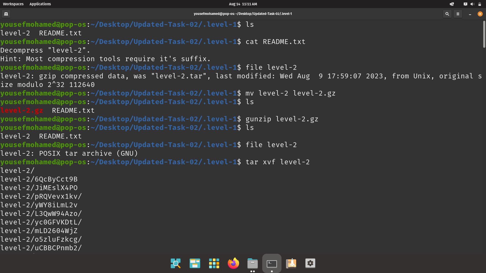
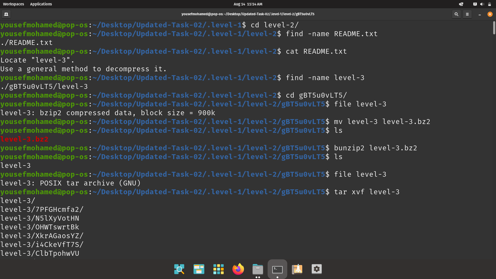
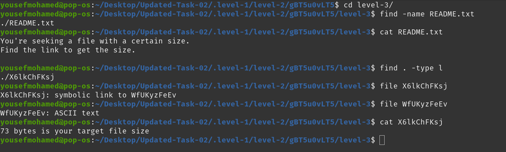
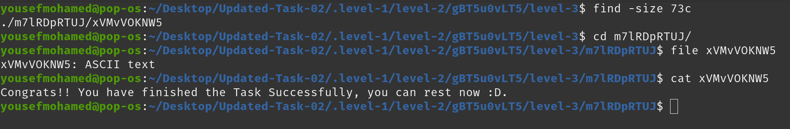

## Step 1
```
ls
unzip Updated-Task-02.zip 
ls
cd Updated-Task-02
```


## Step 2
```
ls
cat README.txt 
ls -a
tar xvf .level-1.tar 
cd .level-1
```


## Step 3
```
ls
cat README.txt 
file level-2 
mv level-2 level-2.gz
ls
gunzip level-2.gz 
ls
file level-2 
tar xvf level-2
```
]

## Step 4
```
cd level-2/
find -name README.txt
cat README.txt
find -name level-3
cd gBT5u0vLT5/
file level-3 
mv level-3 level-3.bz2
ls
bunzip2 level-3.bz2 
ls
file level-3 
tar xvf level-3
```


## Step 5
```
cd level-3/
find -name README.txt
cat README.txt 
find . -type l
file X6lkChFKsj 
file WfUKyzFeEv 
cat X6lkChFKsj 
```


## Step 6
```
find -size 73c
cd m7lRDpRTUJ/
file xVMvVOKNW5 
cat xVMvVOKNW5
```
