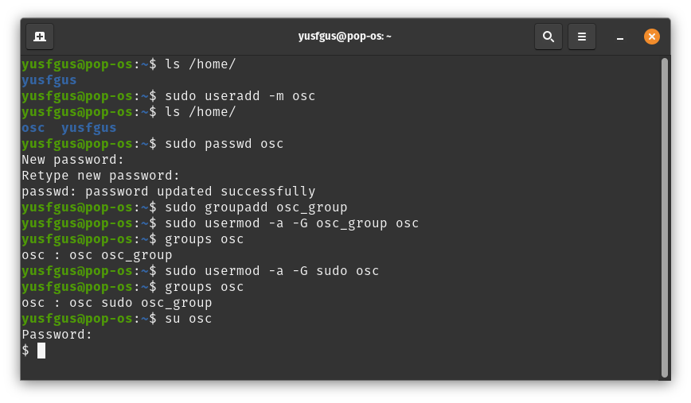
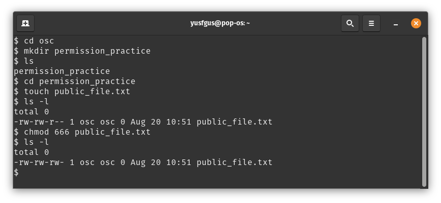
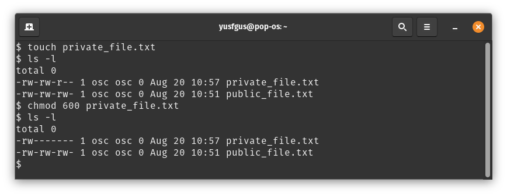
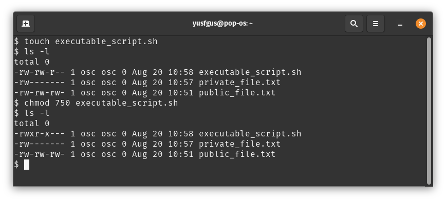
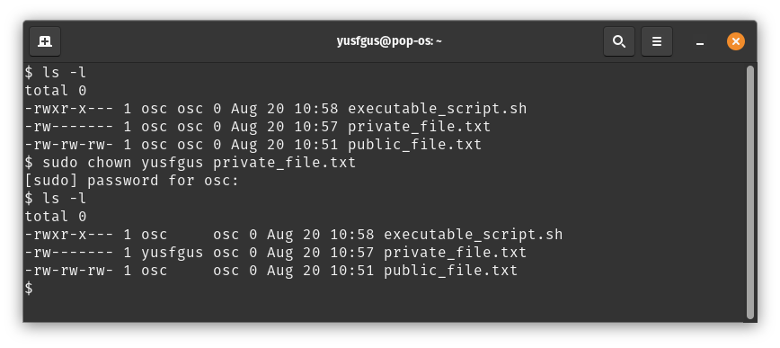
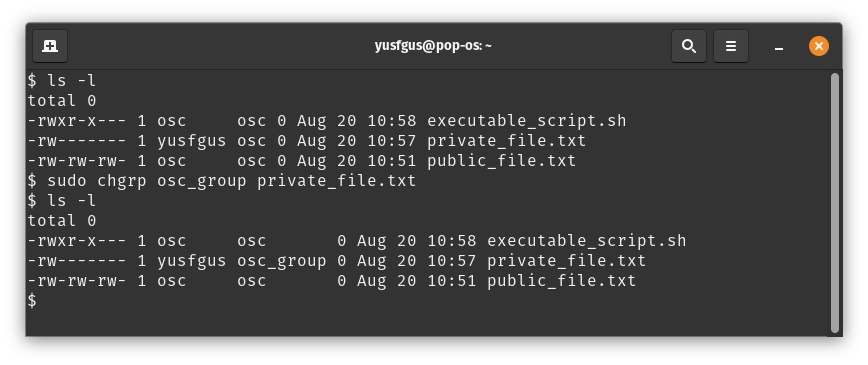
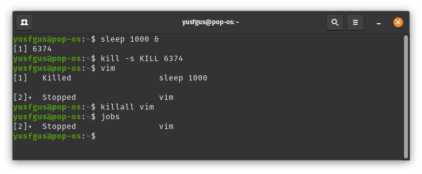
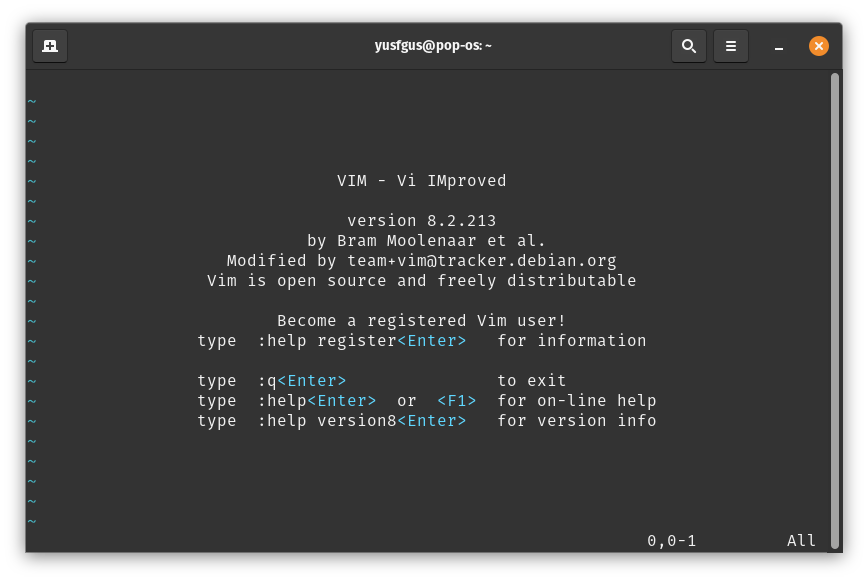

## 1. Create a new user and a group
```
sudo useradd -m osc
ls /home/
sudo passwd osc
sudo groupadd osc_group
sudo usermod -a -G osc_group osc
sudo usermod -a -G sudo osc
su osc
```


## 2. Change the permissions of a file
```
cd osc
mkdir permission_practice
cd permission_practice
touch public_file.txt
chmod 666 public_file.txt
```

```
touch private_file.txt
chmod 600 private_file.txt private_file.txt
```

```
touch executable_script.sh
chmod 750 executable_script.sh
```


## 3. Change the owner of a file
```
sudo chown yusfgus private_file.txt
```

```
sudo chgrp osc_group private_file.txt
```


## 4. Process management
```
sleep 100 &
kill -s KILL 6374
vim
killall vim
jobs
```



## 5. Package management
```
```
