## 1. System Details system_info.sh
```
touch system_info.sh
nano system_info.sh
chmod +x system_info.sh
./system_info.sh
```
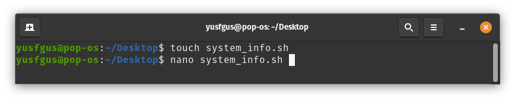
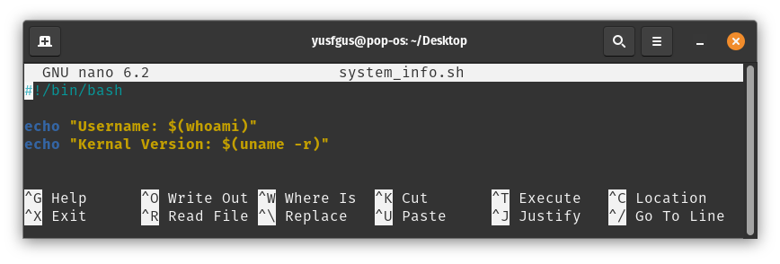
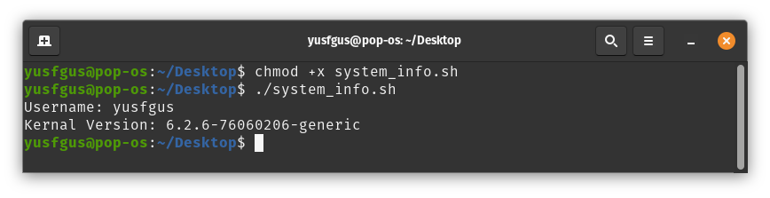

## 2. File Manipulation file_check.sh
```
touch file_check.sh
cmod +x file_check.sh
nano file_check.sh
./file_check.sh system_info.sh ~/Desktop/
./file_check.sh blablabla.txt ~/Desktop/
```
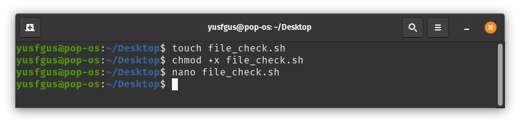
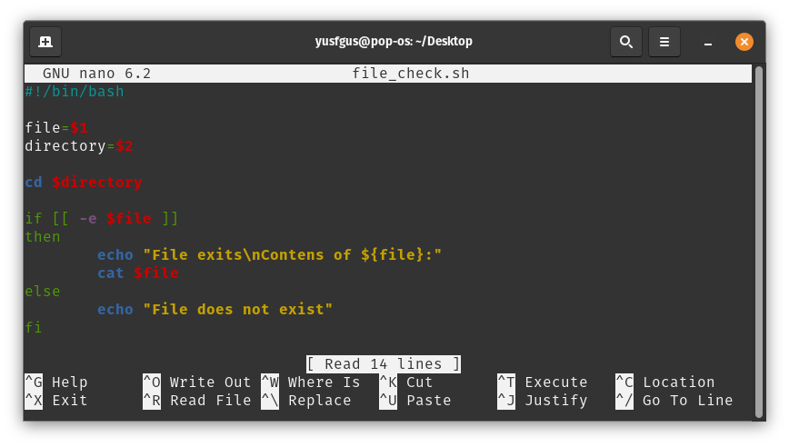
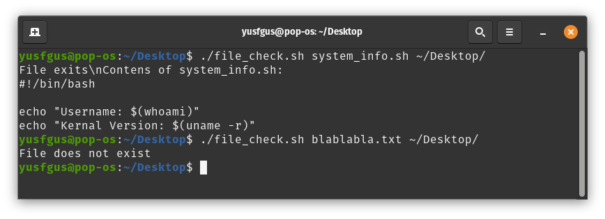

## 3. Renaming Files rename_files.sh
```
touch rename_files.sh
chmod +x rename_files.sh
nano rename_files.sh
touch file1.txt file2.txt file3.txt
./rename_files.sh txt nemo
```
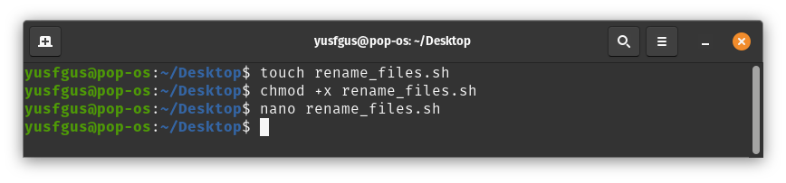
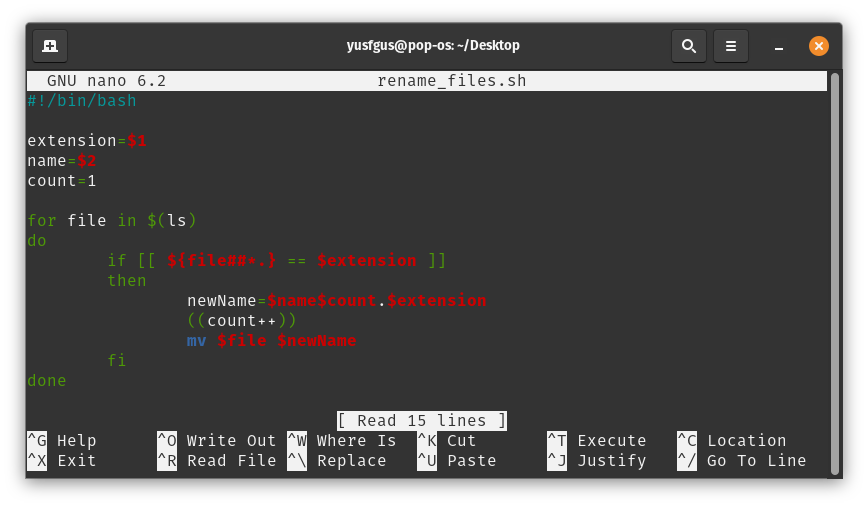
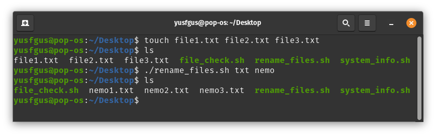

## 4. Menu-Driven Calculator calculator.sh
```
touch calculator.sh
chmod +x calculator.sh
nano calculator.sh
./calculator.sh
```
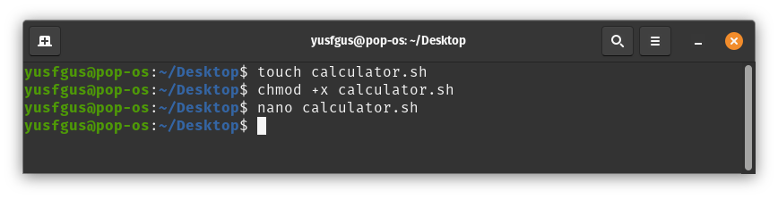
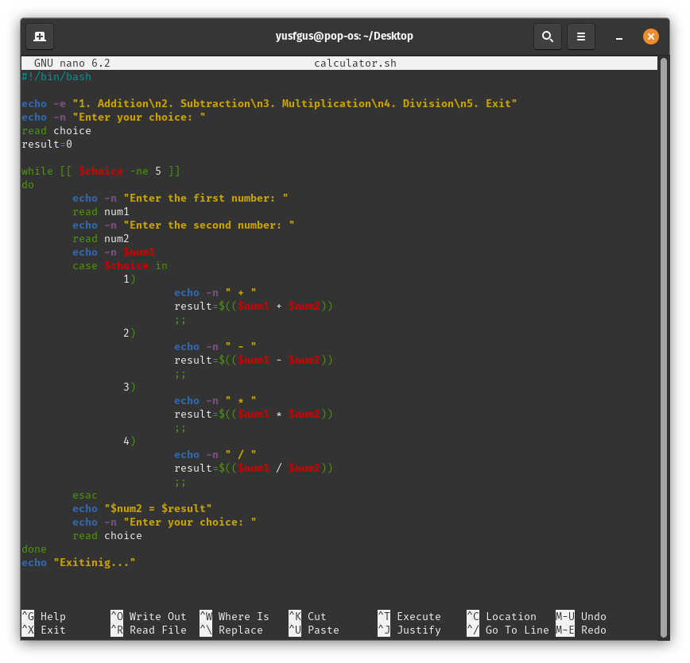
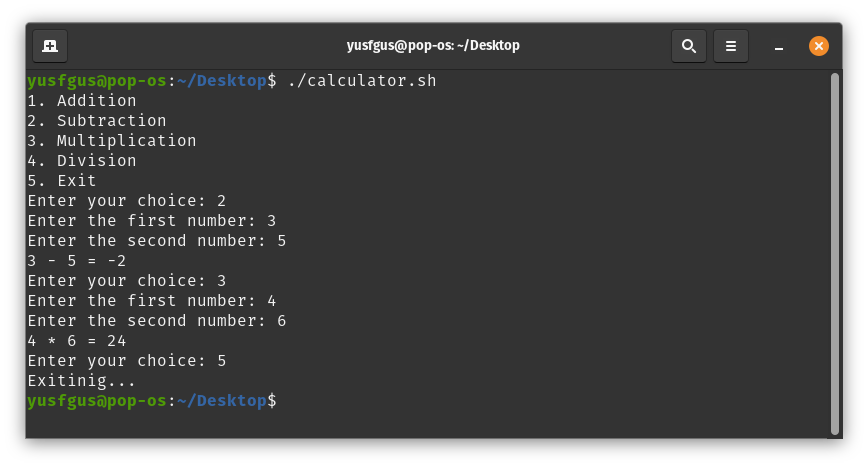
